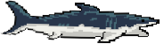
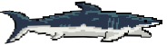
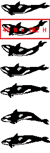
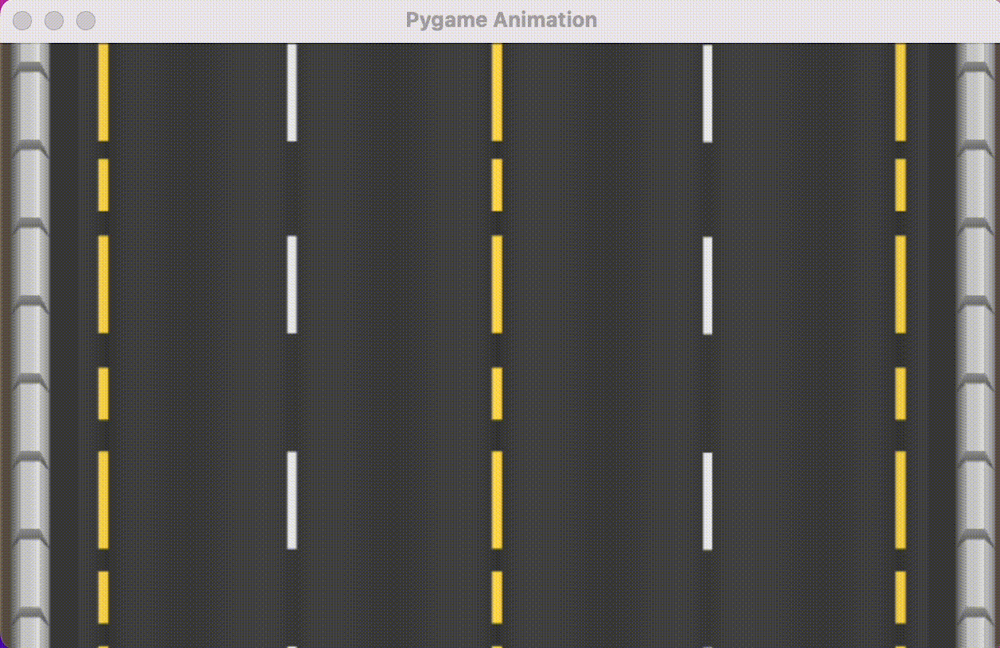
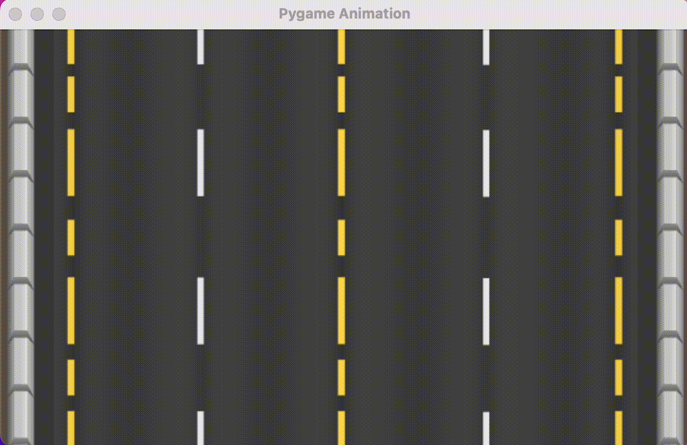

# Basic Animation in Pygame

## Character Animation: Individual Images
The following is a simple approach to create an animated character sprite in your Pygame project. You can see the completed method in the file [animated_character_easy.py](animated_character_easy.py). 

This method assumes you have **separate image files** for each frame of your animation. Here, we'll use these two images:



and



### Approach
For this approach, we will do the following:

- Create a single list that we will use to store all of the animation frames.
- Load each individual image into the list.
- Define a Rect object with which to draw and move the character.
- Draw (or `screen.blit`) the list images onto the Rect object.
- Use a timer to tracking how long each frame has been displayed.
- Change the frame to the next image in the list when the set time is reached.

### Implementation
Here's what the above algorithm looks like in code. (You can find the complete example here in this repo, in the file [animated_character_easy.py](animated_character_easy.py).)

#### Create and load all images into a list.

Recall that lists can store all kinds of data. In this case, we're using it to store images (in Pygame, technically Surface objects).

```python
shark_frames = [
    pygame.image.load("images/shark01.png"),
    pygame.image.load("images/shark02.png")
]
```

Note the formatting using line breaks to make the list easier to read.

#### Define a Rect object with which to draw and move the character.

The `screen.blit` command can draw an image (or Surface object) at specific coordinates or onto a Rect object. For a moving sprite, we want to do the latter because it gives us access to helpful Rect methods (such as `.left` or `.x`).

Here, we'll create a Rect based on the size of the first frame of `shark_frames` (hence, list index `shark_frames[0]`). Then we initialize the Rect position at the middle of our screen:

```python
shark_rect = shark_frames[0].get_rect()
shark_rect.centerx = WIDTH // 2
shark_rect.centery = HEIGHT // 2
```

#### Draw the list images onto the Rect object.
Now that we have our Rect set up, we can draw or `blit` the image with either:

```python
screen.blit(shark_frames[0], shark_rect)
```

or

```python
screen.blit(shark_frames[1], shark_rect)
```

We'll use an index variable `shark_frame_index` so that we can constantly flip the frame index number.

#### Use a timer to tracking how long each frame has been displayed.

We want to change the `shark_frame_index` number automatically, based on time. To do this, we have to set up a timer:

```python
shark_frame_duration = 250  # Frame duration in millseconds (ms)
shark_time_changed = pygame.time.get_ticks()
```

The command `pygame.time.get_ticks()` returns the clock time at the moment it is called. By storing and comparing times stored in variables, you can determine if the appropriate time has elapsed.

For our algorithm, the time of the last frame change is stored in `shark_time_changed`. 

Next, we want to count 250 ms (milliseconds, or 1/1000 of a second).

#### Change the frame to the next image in the list when the set time is reached.

By comparing `time_now` with `shark_time_changed`, we can check if 250 ms has elapsed:

```python
time_now = pygame.time.get_ticks()
if time_now - shark_time_changed > shark_frame_duration:
    if shark_frame_index == (len(shark_frames) - 1):
        shark_frame_index = 0
    else:
        shark_frame_index += 1
    shark_time_changed = time_now
```

Note the `if else` statement used to either increment `shark_frame_index` by `1` (i.e. choose the next frame), or resetting it to `0` when we've reached the end of the list.

<br><br>

## Character Animation: Sprite Sheets
Some of the art you'll find on [OpenGameArt](https://opengameart.org/) is provided as a [sprite sheet](images/sprite_sheet.png). A sprite sheet is a single, static image with many frames of animation tiled across it.

This method differs from the above because you have to essentially "cut up" the sprite sheet or take sections of it for each frame.

In this example, we'll be using this animated [whale sprite sheet](images/whale_sprites.png):



I've used an image editor like Adobe Photoshop (paid) or [Photopea](https://photopea.com) (free, online) to determine that each individual frame is 40 pixels wide by 102 pixels high.

### Approach
For this approach, we will do the following:

- Load the entire sprite sheet as a single surface.
- Define smaller areas — called **subsurfaces** — of this larger sprite sheet. Each subsurface represents one frame in the animation.
- Create a single list to store the frames or subsurfaces.
- Define a Rect object with which to draw and move the character.
- Draw (or `screen.blit`) the list images onto the Rect object.
- Use a timer to tracking how long each frame has been displayed.
- Change the frame to the next image in the list when the set time is reached.

### Implementation
Here's what the above algorithm looks like in code. (You can find the complete example here in this repo, in the file [animated_character_sheet.py](animated_character_sheet.py).)

#### Load the entire sprite sheet as a single surface.
We start be loading the entire sprite sheet:

```python
whale_sprite_sheet = pygame.image.load("images/whale_sprites.png")
```
#### Define subsurfaces of the larger sprite sheet and load into a list.
We use the `.subsurface` method of `whale_sprite_sheet` to subdivide it into smaller images. For the Rect dimensions, you need to know the (x, y) coordinates of the top-left corner, the width, and height:

```python
whale_frame_height = 40
whale_frame_width = 102

whale_frames = [
    whale_sprite_sheet.subsurface(pygame.Rect(0, 40, whale_frame_width, whale_frame_height)),
    whale_sprite_sheet.subsurface(pygame.Rect(0, 120, whale_frame_width, whale_frame_height)),
    whale_sprite_sheet.subsurface(pygame.Rect(0, 220, whale_frame_width, whale_frame_height))
]
```

#### Define a Rect object with which to draw and move the character.
Similar to the above method, we'll use a Rect object to draw and move the image around:

```python
whale_rect = whale_frames[0].get_rect()
whale_rect.centerx = WIDTH // 2
whale_rect.centery = HEIGHT // 2
```

#### Draw (or `screen.blit`) the list images onto the Rect object.
We can manually draw each individual frame of animation now with:

```python
screen.blit(whale_frames[0], whale_rect)
```

or

```python
screen.blit(whale_frames[1], whale_rect)
```

or

```python
screen.blit(whale_frames[2], whale_rect)
```

But we will automate this with a timer and frame counter.


#### Use a timer to tracking how long each frame has been displayed.
Similar to the first method, we use `pygame.time.get_ticks()` to compare the current time with the last time the frame was changed:

```python
whale_frame_duration = 250  # Frame duration in millseconds (ms)
whale_frame_current = 0
whale_frame_last_change_time = pygame.time.get_ticks()
```

and in the main game loop:

```python
time_now = pygame.time.get_ticks()
if time_now - whale_frame_last_change_time > whale_frame_duration:
    whale_frame_current = (whale_frame_current + 1) % len(whale_frames)
    whale_frame_last_change_time = time_now
```

The line with the modulus operator is some programmer shorthand for checking when an incrementing list index reaches its limit. In this case, when the list index reaches `2`, we have to reset it back to `0`.

<br><br>
## Background Animation
The approach to animating a background is identical to animating a sprite. You can look at the road animation I created in the file [animated_background_basic.py](animated_background_basic.py) here.

### Implementation
I'm starting with an image of a road, seen below. Using an image editor, I decided on a 12 frame loop with a subsurface that *excludes* the dirt and road signs on the side. 


I'm loading many more images, but all in a single list just the same:

```python
road_background_full = pygame.image.load("images/road_background.png")

road_background_frame_width = 632
road_background_frame_height = 382
road_background_frames_list = [
    road_background_full.subsurface(pygame.Rect(106, 114, road_background_frame_width, road_background_frame_height)),
    road_background_full.subsurface(pygame.Rect(106, 124, road_background_frame_width, road_background_frame_height)),
    road_background_full.subsurface(pygame.Rect(106, 134, road_background_frame_width, road_background_frame_height)),
    road_background_full.subsurface(pygame.Rect(106, 144, road_background_frame_width, road_background_frame_height)),
    road_background_full.subsurface(pygame.Rect(106, 154, road_background_frame_width, road_background_frame_height)),
    road_background_full.subsurface(pygame.Rect(106, 164, road_background_frame_width, road_background_frame_height)),
    road_background_full.subsurface(pygame.Rect(106, 174, road_background_frame_width, road_background_frame_height)),
    road_background_full.subsurface(pygame.Rect(106, 184, road_background_frame_width, road_background_frame_height)),
    road_background_full.subsurface(pygame.Rect(106, 194, road_background_frame_width, road_background_frame_height)),
    road_background_full.subsurface(pygame.Rect(106, 204, road_background_frame_width, road_background_frame_height)),
    road_background_full.subsurface(pygame.Rect(106, 214, road_background_frame_width, road_background_frame_height)),
    road_background_full.subsurface(pygame.Rect(106, 224, road_background_frame_width, road_background_frame_height))
]
```

The most important thing is to select a set of image that gives you the illusion of a continous, never-ending loop. The final frame must lead into the first frame, otherwise there will an abrupt visual "jump". 

In other words, `road_background_frames_list[11]` needs to look like it flows back into `road_background_frames_list[0]`. 

A smoothly looping animation might look something like this:



If the images at the end and beginning of the list do not match up well, it might look something like this:



Notice the jump in the animation as the list index gets reset. 

The most challenging thing about looping any animation is ensuring the last frame matches smoothly with the first. 

<br><br>

## Background Animation: Refactor
Refactoring in programming is rewriting or restructruing code without changing its external behaviour or functionality. It is often done to clean up poorly written code, eliminate redundancies and repetition, or improve modularity for future expansion.

The implementation in the demo file [animated_background_refactor.py](animated_background_refactor.py) is functionally identical to the above. However, I've refactored it in the following manner:

### Background loading function
Here is a function written to load a sequence of images:

```python
def load_background_frames(image, start_x, start_y, frame_width, frame_height, num_frames, step):
    """
    Load a list of background frames from a larger image.

    Parameters:
        image (pygame.Surface): The source image containing the background frames.
        start_x (int): The x-coordinate of the top-left corner of the first frame.
        start_y (int): The y-coordinate of the top-left corner of the first frame.
        frame_width (int): The width of each frame.
        frame_height (int): The height of each frame.
        num_frames (int): The total number of frames to load.
        step (int): The vertical distance between the top-left corners of consecutive frames.

    Returns:
        list of pygame.Surface: A list of surfaces representing the individual frames.
    """
    frames = []
    for i in range(num_frames):
        frame_rect = pygame.Rect(start_x, start_y + i * step, frame_width, frame_height)
        frame = image.subsurface(frame_rect)
        frames.append(frame)
    return frames
```

Instead of manually loading a long list of subsurfaces, frame-by-frame, I can then populate the `road_background_frames_list` with a single command, calling the function above:

```python
road_background_frames_list = load_background_frames(
    road_background_full, 
    ROAD_BACKGROUND_START_X, 
    ROAD_BACKGROUND_START_Y, 
    ROAD_BACKGROUND_FRAME_WIDTH, 
    ROAD_BACKGROUND_FRAME_HEIGHT, 
    NUMBER_OF_FRAMES, 
    FRAME_STEP
)
```

This kind of modularity allows me to reuse the image loading function in other parts of my program, for example, to load a sprite sheet for my main character.

If you're struggling to get something working, I think it's often helpful to allow yourself to write messy code just to get your ideas down. However, don't forget to revisit and refactor the code before declaring a final version.